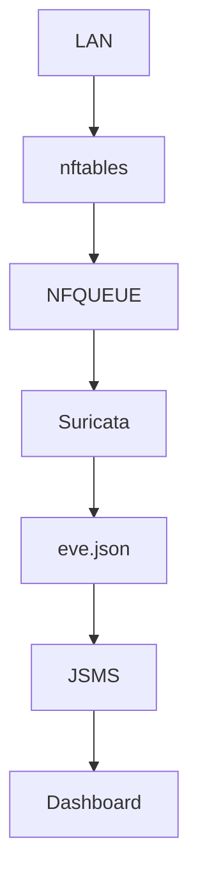

# Guemes

Laboratorio de seguridad, inspección y análisis de tráfico de red.

## Objetivo

Guemes es un entorno orientado a:

- IDS/IPS
- inspección inline
- observabilidad de tráfico
- análisis de amenazas
- hardening Linux
- automatización de red y seguridad
- experimentación con eBPF/XDP

---

## Componentes principales

- Suricata Inline IPS
- nftables / iptables
- NFQUEUE
- Squid Transparente
- GeoIP
- eBPF
- XDP
- JSMS
- Logrotate
- Hardening Linux

---

## Arquitectura



---

## Interfaces

| Rol | Interface |
|---|---|
| WAN | wan |
| LAN | lan |

---

## Colas NFQUEUE

| Cola | Uso |
|---|---|
| q0 | HTTP/HTTPS/Squid |
| q1 | DNS/ICMP/Threat Traffic |

---

# Estructura

```text
guemes/
├── compilacion/
├── configuracion/
├── config_files/
├── iptables-arptables/
├── limpieza-kernels/
├── logrotate/
├── scripts-guemes/
├── services/
├── suricata/
└── docs/
```

---

# Directorios

## compilacion/

Compilación manual de componentes críticos:

- Suricata
- libhtp
- Hyperscan
- herramientas de tracing
- módulos eBPF

Ejemplos:
- flags de compilación
- optimizaciones
- dependencias

---

## configuracion/

Configuraciones generales del sistema:

- sysctl
- tuning de red
- parámetros kernel
- hardening
- performance

---

## config_files/

Archivos completos de configuración:

- suricata.yaml
- squid.conf
- nftables.conf
- sysctl.conf
- resolv.conf
- interfaces de red

---

## iptables-arptables/

Reglas y backups relacionados con:

- iptables
- nftables
- arptables
- NAT
- redirect
- mangle
- NFQUEUE

---

## limpieza-kernels/

Scripts y documentación para:

- limpieza de kernels viejos
- limpieza de módulos
- mantenimiento del bootloader
- espacio en disco

---

## logrotate/

Rotación de logs para:

- Suricata
- Squid
- system logs
- logs custom

Incluye:
- políticas de retención
- compresión
- rotación automática

---

## scripts-guemes/

Automatizaciones y scripts operativos:

- reinicio de servicios
- monitoreo
- exportación GeoIP
- backups
- validaciones
- troubleshooting

---

## services/

Servicios systemd:

- suricata-q0.service
- suricata-q1.service
- squid.service
- scripts auxiliares

Incluye:
- overrides
- restart policies
- tuning systemd

---

## suricata/

Configuraciones y reglas IPS/IDS:

- suricata.yaml
- custom.rules
- threshold.config
- clasificación de eventos
- tuning NFQUEUE

---

# Troubleshooting

## Ver reglas nftables

```bash
nft list ruleset
```

## Ver colas NFQUEUE

```bash
nft list ruleset | grep queue
```

## Ver logs Suricata

```bash
tail -f /opt/suricata/var/log/suricata/eve.json
```

## Estado de servicios

```bash
systemctl status suricata-q0
systemctl status suricata-q1
systemctl status squid
```

---

# Tecnologías

- Suricata
- nftables
- iptables
- NFQUEUE
- Squid
- GeoIP
- eBPF
- XDP
- Prometheus
- Grafana

---

# Estado

🚧 Laboratorio activo de investigación, observabilidad y seguridad ofensiva/defensiva.