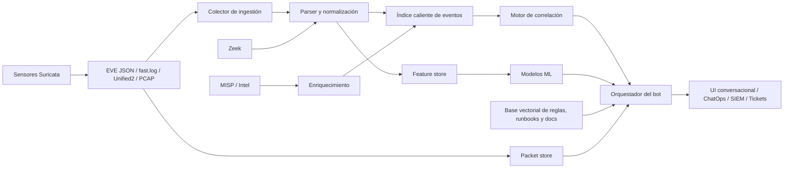
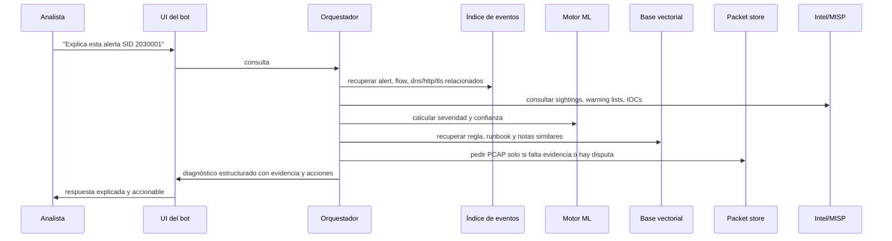
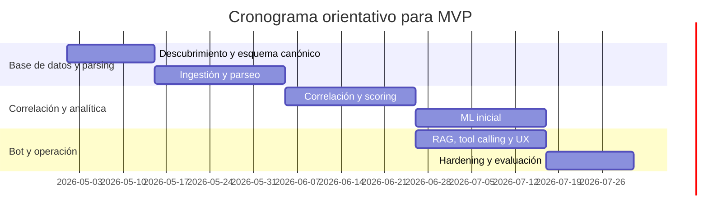

# Diseño de un chatbot para analizar y diagnosticar alertas y logs de Suricata

## Resumen ejecutivo

Un chatbot realmente útil para Suricata no debe ser “un LLM que lee logs”, sino una **cadena de análisis guiada por evidencia**: ingestión confiable, parseo estructurado, normalización de campos, correlación con otras fuentes, scoring y, solo al final, una capa conversacional que explique, priorice y recomiende acciones. Suricata ya ofrece una base excelente para ese diseño porque puede trabajar sobre tráfico en vivo y sobre PCAPs, emitir eventos en **EVE JSON**, generar `fast.log`, registrar paquetes en PCAP y, en versiones antiguas, producir Unified2; además, la salida EVE ya expone campos muy valiosos para diagnóstico como `timestamp`, `event_type`, `src_ip`, `dest_ip`, `app_proto`, `community_id` y un objeto `alert` con `action`, `category`, `severity`, `gid`, `rev`, `signature`, `signature_id`, `references`, `metadata` y hasta la regla cuando está disponible. citeturn13search11turn42view0turn42view1turn42view2turn36view4turn7view1turn7view2

La recomendación arquitectónica más sólida es usar **`eve.json` como fuente canónica**, tratar `fast.log` y Unified2 como entradas heredadas que se convierten a un modelo común, y dejar el **PCAP como evidencia forense de segundo nivel** para reconstrucción, validación y hunting, no como formato primario para el razonamiento del bot. En otras palabras: el bot debe razonar sobre eventos y features, y recurrir a los paquetes crudos solo cuando haga falta explicar un match, reconstruir una transacción o resolver una discrepancia. Esto reduce latencia, costo y exposición de datos sensibles, sin perder capacidad forense. citeturn40view0turn40view1turn22view1turn22view0turn29view1turn7view3

En términos de producto, el mayor retorno de valor no viene de “responder preguntas”, sino de resolver tareas operativas de alto dolor: **triage de alertas, estimación de falso positivo, atribución de regla, correlación con Zeek/MISP/SIEM, reconstrucción de línea temporal, extracción de IOCs y sugerencia de remediación**. La literatura y la experiencia de SOC muestran que la fatiga de alertas y la baja calidad contextual de muchas alarmas son el cuello de botella real; por eso el bot debe combinar heurística determinista, correlación contextual, modelos supervisados o de anomalía y explicaciones estructuradas. Los sistemas de triage asistido por ML ya han mostrado reducciones operativas significativas de cola de alertas en entornos SOC, mientras que trabajos clásicos sobre verificación de alertas muestran que la correlación contextual reduce sustancialmente falsos positivos. citeturn31view0turn31view1turn31view2

La conclusión práctica es clara: para un **MVP serio**, conviene construir un sistema **híbrido on-prem o híbrido** con ingestión local de logs y PCAP, un índice caliente para eventos y features, una base vectorial o vector-capable para reglas, runbooks y documentación, y un LLM con **structured outputs** y **function calling** para consultar herramientas externas de forma controlada. El LLM no debe decidir solo; debe **orquestar** consultas, devolver diagnósticos trazables y citar evidencia. En la mayoría de organizaciones, un MVP útil puede entregarse en **12 a 16 semanas** con un equipo pequeño pero interdisciplinario, siempre que ya exista al menos una base mínima de telemetría y acceso a reglas/runbooks. citeturn38view4turn38view5turn30search3turn38view6turn38view9

## Objetivos operativos y capacidades del producto

El diseño debe partir de los usuarios reales, no del modelo. En un SOC, la necesidad principal no es “hablar con la IA”, sino **reducir tiempo de validación, hacer explícita la evidencia y bajar el costo cognitivo de correlacionar piezas dispersas**. Los estudios sobre operaciones SOC muestran que la validación manual de falsas alarmas es tediosa, genera burnout y exige alarmas más confiables, explicables, analíticas, contextuales y transferibles. En paralelo, el trabajo de triage automatizado demuestra que el mayor valor aparece cuando el sistema aprende o imita decisiones humanas de priorización y cierre, no cuando intenta “reemplazar” a los analistas. citeturn31view1turn31view0

### Objetivos de producto y user stories

| Rol | Trabajo principal | Qué debe hacer el bot | Resultado esperado |
|---|---|---|---|
| Analista L1/L2 | Entender por qué disparó una alerta y decidir si escalar | Resumir la alerta, explicar la regla, mostrar evidencia de soporte, estimar probabilidad de falso positivo, ubicar eventos relacionados y proponer próximos pasos | Menor tiempo de triage y menos búsquedas manuales |
| Líder de SOC | Priorizar backlog y medir calidad del pipeline | Agrupar alertas similares, puntuar severidad y confianza, detectar desbordes o pérdida de alertas, producir vistas por campaña/host/regla | Reducción de fatiga y mejor uso del equipo |
| Incident responder | Reconstruir actividad y contener | Crear línea temporal, extraer IOCs, cruzar con inteligencia, señalar hosts/usuarios/servicios afectados y sugerir acciones de contención y validación | Respuesta más rápida y consistente |

La tabla anterior refleja necesidades operativas ampliamente consistentes con la literatura sobre validación de alarmas en SOC y con enfoques de triage automatizado. citeturn31view1turn31view0

### Capacidades funcionales que el bot debe ofrecer

| Capacidad | Qué requiere | Cómo debería responder |
|---|---|---|
| Triage de alertas | `alert`, `flow`, logs de protocolo, contexto de activo | Resumen corto, hipótesis principal, evidencia a favor/en contra, acciones siguientes |
| Estimación de falso positivo | Contexto del sitio, patrones benignos, warning lists, feedback histórico | Probabilidad o banda de confianza, factores de riesgo, razón de duda |
| Atribución de regla | `gid`, `sid`, `rev`, `signature`, `category`, `references`, `metadata`, texto de regla si está disponible | Explicación de qué buscó la regla, por qué disparó y qué significado operacional tiene |
| Correlación cruzada | EVE, Zeek, SIEM, MISP, ventanas temporales, `community_id`, hashes, 5-tupla | Vista unificada por flujo/host/campaña |
| Reconstrucción de timeline | `flow.start/end`, eventos por host, PCAP, logs de aplicación | Línea temporal ordenada y con hitos relevantes |
| Remediación sugerida | Tipo de amenaza, rol del activo, playbook, inteligencia | Recomendaciones separadas en “contener”, “validar”, “erradicar”, “monitorizar” |
| Scoring de severidad | Prioridad/classtype de regla, confianza del modelo, observabilidad, criticidad de activo, sightings/intel | Score compuesto y explicable |
| Extracción de IOCs | `alert.metadata`, referencias, logs de protocolo, `fileinfo`, MISP | Lista normalizada de IP, dominio, URL, hash, JA3/JA4, SNI, nombre de archivo, etc. |

Estas capacidades están alineadas con los campos expuestos por EVE, con la exportación de reglas/IOC desde MISP, con el uso de `community_id` en Zeek para correlación inter-herramienta y con trabajos de verificación contextual y explicabilidad en NIDS. citeturn42view0turn42view1turn42view2turn37view0turn40view2turn38view10turn40view3turn31view2turn32view0

### Recomendación de scoring

Conviene separar dos conceptos:

**Severidad**: cuán dañino sería el evento si fuera verdadero.  
**Confianza**: cuánta evidencia hay de que el evento sea real y accionable.

Una formulación práctica para el bot es:

- **Severidad propuesta** = peso de regla + categoría + criticidad de activo + impacto observado
- **Confianza propuesta** = correlación multifuente + coherencia temporal + sightings/intel + consistencia del tráfico + confianza del modelo

Una versión inicial razonable del score compuesto es:

`score_total = 0.35*severidad + 0.35*confianza + 0.20*criticidad_activo + 0.10*urgencia_operativa`

Los insumos para construir ese score están disponibles en los metadatos de reglas de Suricata, en los eventos `flow`/`alert`, en MISP sightings y warning lists, y en la correlación con otras fuentes. citeturn12view0turn42view0turn37view0turn40view2turn38view10

## Datos de Suricata y parsing

La decisión más importante de datos es **qué formatos soportar en primera clase y cuáles tratar como compatibilidad heredada**. En un diseño moderno, `eve.json` debe ser el centro del sistema porque expone eventos tipados y campos reutilizables; `fast.log` sigue siendo útil donde todavía existe pipeline legado o lectura humana directa; Unified2 debe tratarse como historia operativa, no como objetivo nuevo de plataforma; y el PCAP debe preservarse para análisis profundo y verificación puntual. citeturn40view0turn7view1turn3view2turn29view1turn7view3

### Fuentes de datos, formatos, campos clave y retos

| Fuente | Formato | Valor para el bot | Campos clave | Retos de parseo |
|---|---|---|---|---|
| `eve.json` | JSON por línea / EVE | Fuente principal de alertas, flujos, protocolos, archivos y estadísticas | `timestamp`, `event_type`, `src_ip`, `dest_ip`, `app_proto`, `community_id`, `pcap_cnt`, objeto `alert` con `action`, `category`, `severity`, `gid`, `rev`, `signature`, `signature_id`, `references`, `metadata`, y objeto `flow` con `start`, `end`, `bytes_*`, `pkts_*`, `reason`, `state`, `tx_cnt` | Campos opcionales por tipo de evento, nested objects, diferencias entre versiones, ordering cuando se divide en múltiples archivos |
| `fast.log` | Texto humano legible | Compatibilidad con pipelines antiguos y lectura rápida | Fecha/hora, `[gid:sid:rev]`, mensaje, clasificación, prioridad, protocolo, IP/puertos | Texto no estructurado, menos contexto, dependencia de grok/dissect/regex |
| Unified2 | Binario heredado | Solo para despliegues antiguos | Eventos binarios basados en alertas | Formato legado y soporte retirado desde Suricata 6.0 |
| PCAP / pcap-log | Paquetes completos o condicionados por regla | Verificación forense, recreación de transacciones, hunting y QA | Paquetes, payload, `pcap_cnt`, nombre de archivo, contexto temporal | Costo de almacenamiento, privacidad, CPU y latencia; no apto como fuente primaria de razonamiento online |

Base documental de la tabla: el índice EVE documenta campos top-level y del objeto `alert`, el objeto `flow` y varios campos de apoyo como `community_id`, `pcap_cnt` y `app_proto`; la documentación de salidas muestra `fast.log`, `pcap-log` y EVE; y la guía de actualización de Suricata 6 confirma la retirada de Unified2. citeturn42view0turn42view1turn42view2turn37view0turn36view4turn7view1turn7view2turn7view3turn3view2

### Desafíos de parsing que el bot debe conocer

No basta con parsear; hay que **interpretar la semántica operacional del log**. Primero, Suricata puede separar la salida EVE en varios archivos por hilo, por ejemplo `eve.9.json`, `eve.10.json`, etc.; eso complica el reordenamiento temporal y la deduplicación si el pipeline asume un solo archivo. Segundo, si se activa el manejo de `X-Forwarded-For`, los campos IP pueden sobrescribirse o preservarse según la configuración, de modo que el bot debe conocer la política utilizada o marcar la procedencia del dato. Tercero, el motor puede descartar alertas de menor prioridad si se alcanza `packet-alert-max`, registrando `detect.alert_queue_overflow`; si el chatbot no expone esta condición, puede dar una falsa sensación de completitud. Finalmente, la rotación de logs en Suricata depende normalmente de herramientas externas como `logrotate` y una señal `SIGHUP`, así que cualquier pipeline de ingestión debe manejar bien renombres, truncados y offsets. citeturn8view0turn9view0turn11view0turn24search2turn18view3

### Comparativa de enfoques y herramientas de parsing

| Enfoque | Mejor uso | Ventajas | Limitaciones | Recomendación |
|---|---|---|---|---|
| Parser JSON nativo | `eve.json` | Máxima fidelidad al esquema, bajo costo, fácil validación | Requiere controlar versionado del esquema y campos opcionales | Opción por defecto para EVE |
| Logstash `json` | `eve.json` encapsulado en `message` o pipelines mixtos | Parsea JSON y marca `_jsonparsefailure`/`_timestampparsefailure` | Más componentes y tuning | Bueno cuando ya existe Logstash |
| Logstash `dissect` | `fast.log` estable | Más rápido que regex/grok en formatos delimitados | Poco flexible ante variación | Úselo primero en logs legados estables |
| Logstash `grok` | `fast.log` variable | Flexible para texto poco estructurado | Más costoso y frágil que `dissect` | Úselo solo donde regex sea inevitable |
| Filebeat/Elastic Agent integración Suricata | `eve.json` hacia Elastic | Ingest pipelines, dashboards, rutas por defecto, ECS | Optimizado sobre todo para ecosistema Elastic | Excelente si Elastic ya es el índice caliente |
| Parser ad hoc en Python/Go/Rust | EVE + fuentes especiales + enriquecimiento propio | Máxima flexibilidad, control de versionado y pruebas | Mayor coste de desarrollo y mantenimiento | Preferible cuando el bot es producto central, no accesorio |

Base documental de la tabla: Logstash documenta el filtro `json`, `grok` y `dissect`, incluyendo que `dissect` es más rápido cuando el formato es repetitivo y que `grok` es mejor cuando la estructura varía; Filebeat y Elastic Agent documentan módulos/integraciones específicos para Suricata EVE y el uso de ingest pipelines. citeturn18view0turn18view1turn18view2turn40view1turn40view0turn18view5

### Recomendación de modelo de normalización

La mejor práctica es normalizar todo a un **esquema común tipo ECS** o a un esquema interno equivalente. El objetivo no es “hacer bonito el JSON”, sino permitir correlación consistente entre Suricata, Zeek, IOC/intel, inventario y tickets. ECS fue diseñado precisamente para normalizar eventos y facilitar búsqueda, visualización y correlación entre datos heterogéneos. citeturn38view7

## Enfoques analíticos y de IA

La lógica del bot debe ser **estratificada**. El orden correcto es:

1. **Parsing y normalización deterministas**
2. **Correlación y heurísticas**
3. **Modelos estadísticos/ML**
4. **LLM para explicación, consulta y orquestación**

Ese orden es importante porque el mayor fracaso en productos SOC con LLM suele venir de intentar que el modelo “adivine” estructura o contexto que ya existía en los datos. Además, la investigación sobre SOC y NIDS deja claro que la explicabilidad, el contexto y la reducción de falsos positivos importan tanto como la capacidad de detección. citeturn31view1turn31view2turn32view0

### Capacidades diagnósticas específicas

**Triage de alerta.** El bot debe resumir la alerta en una frase, mostrar qué regla disparó, si hubo correlación con flujo/protocolo/archivo, si existen sightings o IOC relacionados, y qué evidencias apoyarían o debilitarían la hipótesis. Los campos del objeto `alert`, del objeto `flow` y del protocolo correspondiente suelen bastar para un triage inicial de alta calidad. citeturn42view0turn42view1turn37view0turn40view0

**Estimación de falso positivo.** No debe verse como una sola probabilidad, sino como una combinación de señales: contexto del sitio, MISP warning lists, historial del host, comportamiento de salida, retroalimentación de analistas y consistencia del protocolo. Esto está en línea con trabajos operativos que muestran que muchas “falsas positivas” son, en realidad, disparos técnicamente correctos sobre comportamiento benigno contextual, y con trabajos como ATLANTIDES que reducen FP correlando alertas con anomalías observables en la salida. citeturn31view1turn31view2turn38view10

**Atribución de regla.** Es imprescindible mapear `gid:sid:rev`, `signature`, `category`, `severity`, `references` y `metadata` a la regla real, su fuente y su intención. En logs legados como `fast.log`, la tupla `[gid:sid:rev]` ya aparece; en EVE, el objeto `alert` expone de forma más completa la información para explicación y trazabilidad. Si se habilita el texto de regla, el bot puede incluso explicar qué buffers o keywords participaron en el match. citeturn12view0turn42view0turn42view1

**Correlación y timeline.** Para correlación interna, priorice transacciones, flujo, 5-tupla y proximidad temporal; para correlación entre herramientas, `community_id` es especialmente valioso porque Zeek lo soporta de forma nativa en `conn.log` desde Zeek 6+ y Suricata puede producirlo en EVE. En Zeek, `conn.log` describe quién habló con quién, cuándo, durante cuánto tiempo y con qué protocolo, lo que encaja muy bien como complemento de Suricata. citeturn40view3turn20search17turn20search0turn36view4

### Comparativa de modelos ML

| Familia | Tipo | Dónde encaja mejor | Fortalezas | Riesgos / límites |
|---|---|---|---|---|
| Heurísticas + reglas | Determinista | MVP, explicabilidad, entornos regulados | Trazabilidad máxima, cero entrenamiento | Cobertura limitada ante cambios de contexto |
| Isolation Forest | Anomalía no supervisada | Baselines por activo, puerto, servicio, hora | Eficiente y útil cuando faltan etiquetas | Puede disparar mucho con drift operativo |
| One-Class SVM | Novedad / outlier | Nichos con poco dato y fronteras finas | Bueno para novelty detection | Escala peor y es sensible a kernel/parámetros |
| Random Forest / XGBoost | Supervisado tabular | Triage con feedback histórico de analista | Muy fuertes en features tabulares y ranking | Requieren etiquetas consistentes y control de drift |
| LSTM / modelos secuenciales | Supervisado temporal | Campañas multi-evento y secuencias | Capturan dependencia temporal | Más coste, menor interpretabilidad |
| Autoencoders / VAE | Reconstrucción / anomalía | Detección de desviaciones complejas | Útiles para patrones no lineales | Más opacos y más difíciles de calibrar |

Base documental de la tabla: Isolation Forest se basa en aislar observaciones mediante particiones aleatorias; One-Class SVM se usa en novelty detection; Random Forest y XGBoost son referencias fuertes para clasificación tabular; LSTM se ha usado para NIDS secuencial; y trabajos recientes sobre explicación de DL-NIDS enfatizan la necesidad de considerar historia e interpretabilidad. citeturn27search0turn27search1turn27search2turn26search2turn26search19turn32view0

### Recomendación de ML por fases

Para una primera fase, la mejor combinación suele ser:

- **Heurísticas + correlación + score compuesto** como baseline productivo.
- **Modelo supervisado tabular** para priorización y falso positivo si existe feedback histórico.
- **Isolation Forest** por activo/servicio para descubrir outliers operativos.
- **Secuenciales** solo en una fase posterior, cuando ya existan datos etiquetados y métricas sólidas.

La razón es práctica: en SOC reales, el valor incremental más rápido viene de aprender patrones de triage y de agrupar contexto, no de introducir de inmediato deep learning complejo. El sistema AACT es un buen ejemplo de esa prioridad operativa. citeturn31view0

### Prompt engineering y uso del LLM

La capa LLM debe operar como **sistema de explicación y orquestación**, no como parser universal. Las mejores prácticas aquí son cuatro:

1. **Recuperación aumentada por búsqueda** sobre reglas, runbooks, clasificaciones, playbooks, manuales internos y notas de analistas.
2. **Structured outputs** con un JSON Schema estricto para que la respuesta tenga campos obligatorios como diagnóstico, evidencia, confianza, IOCs, acciones y limitaciones.
3. **Function calling** para consultar índices, MISP, packet store, Zeek o ticketing sin dejar que el modelo improvise datos.
4. **Evaluaciones explícitas**: el prompting debe mejorarse contra criterios de éxito medibles, no solo “parece responder bien”. citeturn30search3turn38view4turn38view5turn38view6

Un esquema de salida muy recomendable para el bot es:

```json
{
  "resumen": "...",
  "hipotesis_principal": "...",
  "severidad": 0,
  "confianza": 0.0,
  "evidencia_a_favor": [],
  "evidencia_en_contra": [],
  "ioc_extraidos": [],
  "eventos_relacionados": [],
  "acciones_sugeridas": {
    "contener": [],
    "validar": [],
    "erradicar": [],
    "monitorizar": []
  },
  "lagunas_de_evidencia": [],
  "fuentes_consultadas": []
}
```

Ese patrón reduce alucinación estructural, facilita auditoría y permite medir consistencia de respuestas entre versiones del sistema. citeturn38view4turn38view5

### Comparativa de opciones de vector DB y búsqueda semántica

| Opción | Tipo | Ventaja principal | Cuándo elegirla |
|---|---|---|---|
| Elasticsearch `dense_vector` | Motor de búsqueda + vectores | No añade componente nuevo si ya usa Elastic | Si el índice caliente ya vive en Elastic |
| OpenSearch vector search | Motor de búsqueda + vectores | Similar a Elastic, útil en stacks OpenSearch | Si el SIEM/telemetría ya está ahí |
| Qdrant | Vector DB dedicado | Búsqueda filtrada y operación liviana, incluso edge/offline | Si quiere RAG dedicado y simple |
| `pgvector` | Extensión de PostgreSQL | JOINs, ACID, PITR y un solo datastore | Si el corpus y la concurrencia son moderados |
| Milvus | Vector DB a escala | Orientado a despliegues grandes y muy vectoriales | Si el corpus es enorme y el RAG es central |

Base documental de la tabla: Elasticsearch documenta `dense_vector` para embeddings; OpenSearch documenta vector search/k-NN; Qdrant se presenta como motor/vector DB con filtrado e incluso modalidad edge; `pgvector` documenta búsqueda exacta y aproximada dentro de PostgreSQL; y Milvus documenta despliegue local y cloud para aplicaciones de similitud a escala. citeturn38view0turn14search15turn14search3turn38view1turn38view3turn38view2

La recomendación práctica es sencilla: si ya existe una adopción fuerte de entity["company","Elastic","search company"], empiece por `dense_vector` o por búsqueda híbrida en el mismo stack; si necesita un componente independiente y ligero, Qdrant es muy atractivo; si la organización prefiere consolidar en PostgreSQL, `pgvector` es excelente para un corpus documental mediano. citeturn38view0turn38view1turn38view3

## Arquitectura, despliegue e integraciones

La arquitectura ideal para este caso es **híbrida y desacoplada**: ingestión cerca del sensor, normalización temprana, almacenamiento caliente para eventos, almacenamiento más barato para históricos y PCAP, y una capa conversacional que consulte herramientas de forma explícita. Esto protege soberanía de datos, reduce latencia de ingestión y permite usar nube donde aporta valor sin subir necesariamente el contenido completo de paquetes. Los componentes de packet store y threat intel ya documentan despliegues escalables, control de acceso y escenarios on-prem/cloud; además, Elastic soporta la gestión de lifecycle en despliegues versionados y serverless. citeturn22view1turn22view0turn24search7turn38view9

### Diagrama de flujo de datos propuesto



El diseño anterior refleja la separación recomendada entre ingestión, parseo, correlación, ML, RAG y acceso a evidencia profunda. La integración oficial de Suricata con Elastic se basa precisamente en ingerir EVE JSON desde archivo; Arkime, por su parte, está diseñado para almacenar y exportar PCAP estándar y exponer APIs de sesión/packet data. citeturn40view0turn40view1turn22view1

### Diagrama de flujo de una consulta diagnóstica



Este patrón evita que el LLM responda “desde memoria” y fuerza consulta de fuentes de evidencia externas, alineándose con RAG, structured outputs y function calling. citeturn30search3turn38view4turn38view5

### Opciones de hosting

| Opción | Ventajas | Riesgos | Recomendación |
|---|---|---|---|
| On-prem | Máximo control sobre PCAP, baja exposición y soberanía total | Mayor carga operativa y capacidad | Mejor para entornos regulados o con captura completa |
| Cloud en IaaS propio | Elasticidad y automatización sin depender tanto de SaaS cerrado | El paquete completo y la intel sensible siguen fuera del perímetro físico | Útil si la organización ya corre SOC en nube privada o pública |
| Servicios gestionados | Menor carga operativa del índice/vector/LLM | Más fricción de privacidad, residencia y costo variable | Adecuado solo si se minimiza qué datos suben |
| Híbrido | Logs/eventos on-prem, búsquedas/LLM/documentación en nube o segmento separado | Más complejidad de integración | Suele ser el mejor compromiso para este caso |

La tabla refleja una inferencia arquitectónica apoyada por documentación oficial que muestra disponibilidad local/cloud de varios componentes y la preferencia on-prem cuando la sensibilidad de la inteligencia o de los paquetes es alta. citeturn24search7turn38view9turn38view1turn38view2turn38view3

### Seguridad, privacidad, latencia y retención

**Seguridad y privacidad.** El mayor riesgo no está en el texto del bot, sino en el **contenido crudo**: PCAP, payloads, archivos extraídos y datos enriquecidos. Arkime documenta controles de acceso por HTTPS/TLS y el hecho de que los PCAP se almacenan en sensores y se acceden por interfaz o API; Suricata también puede registrar paquetes completos en `pcap-log`, incluso de forma condicional por regla. La recomendación es que el LLM vea preferentemente **features, metadatos y fragmentos minimizados**, no payload crudo por defecto. citeturn22view1turn7view3

**Latencia.** El camino “rápido” debe terminar antes del LLM: parseo, indexación, correlación primaria y scoring. El LLM se invoca al solicitar explicación, enriquecimiento o resumen, no necesariamente en cada evento. Eso mantiene el pipeline de detección independiente del pipeline conversacional. La compatibilidad de Elastic Agent/Filebeat con ingest pipelines y con EVE JSON facilita precisamente esa separación. citeturn40view0turn40view1turn18view5

**Retención.** Para eventos y features, use ILM o data stream lifecycle; para PCAP, aplique retención separada, normalmente mucho más corta. Elastic documenta retención, rollover, borrado automático y downsampling para time-series, mientras que Arkime explica que la retención de PCAP depende del disco del sensor y la de metadatos de la escala del clúster. La política recomendada suele ser: eventos 90–365 días, resúmenes/enriquecimientos más tiempo, PCAP 3–30 días salvo incidentes concretos. Eso último ya es una propuesta, no una regla universal. citeturn38view8turn38view9turn22view1

### Puntos de integración clave

**SIEM y Elastic Stack.** La integración oficial de Elastic para Suricata ingiere EVE JSON, soporta varios tipos de evento y permite correlación y alertado dentro del despliegue Elastic; el módulo de Filebeat añade rutas por defecto, ingest pipeline y dashboards. Si ya existe un SIEM distinto, el mismo principio se mantiene: consumir EVE por archivo o syslog, normalizar y correlacionar. citeturn40view0turn40view1turn7view1

**MISP.** MISP es muy valioso en dos direcciones: puede **exportar reglas NIDS para Suricata/Snort** y puede recibir/consultar **sightings** por API; además, sus **warning lists** ayudan a filtrar indicadores propensos a falso positivo o conocidos benignos. Para un chatbot, esto es oro: le permite decir no solo “esto coincide con un IOC”, sino también “este IOC aparece en warning list” o “ya fue observado antes por la organización”. citeturn41search2turn40view2turn38view10

**Zeek.** Zeek puede escribir JSON, `conn.log` resume conversaciones de red y el soporte nativo de `community_id` desde Zeek 6+ habilita pivote real entre Suricata y Zeek. En la práctica, Suricata aporta detección por firma y eventos de aplicación; Zeek aporta contexto transaccional y visibilidad lateral. citeturn20search0turn20search17turn40view3

**Packet stores.** Arkime encaja muy bien como repositorio de respaldo porque almacena/expone PCAP estándar, indexa sesiones, exporta PCAP o CSV y tiene APIs para consumir datos de sesión JSON. Para el bot, eso significa poder ofrecer un comando del tipo “muéstrame la sesión exacta” o “extrae el PCAP de este conjunto de eventos”. citeturn22view0turn22view1

## Implementación, conversaciones de ejemplo y evaluación

### Plan de implementación propuesto

| Fase | Alcance | Entregables | Esfuerzo estimado |
|---|---|---|---|
| Descubrimiento y modelo canónico | Inventario de fuentes, versiones, reglas, activos y playbooks | Esquema canónico, mapa de campos, riesgos de datos | 2–3 semanas |
| Ingestión y parseo | EVE canónico, soporte legado a `fast.log`, política Unified2/PCAP | Pipelines, validadores, pruebas de parsing | 3–4 semanas |
| Correlación y scoring | Agregación por host/flujo/campaña, ties con Zeek/MISP, score base | API de correlación, score explicable, vistas base | 3–4 semanas |
| ML inicial | Baseline heurístico + un modelo tabular de triage o anomalía | Modelo entrenado, métricas y umbrales | 3–4 semanas |
| LLM y UX conversacional | RAG, function calling, structured outputs, UI/chatops | Bot funcional, prompts, guardrails, auditoría | 3–4 semanas |
| Hardening y evaluación | Retención, seguridad, tests, datasets, red-team y aceptación | Informe de evaluación, runbook de operación, SLOs | 2–3 semanas |

**Esfuerzo total orientativo para MVP:** 16–22 semanas-persona, o unas 12–16 semanas calendario con un equipo pequeño y foco claro. Esta es una **estimación propuesta**, no una cifra normativa.

### Perfil de equipo recomendado

| Perfil | Dedicación típica | Responsabilidad principal |
|---|---|---|
| Detection engineer | Alta | Reglas, interpretación Suricata, tuning y validación |
| Data/backend engineer | Alta | Ingestión, parseo, API, normalización |
| ML engineer | Media | Modelos de scoring, calibración, evaluación |
| Ingeniero de plataforma/seguridad | Media | Despliegue, retención, secretos, observabilidad |
| Especialista LLM/app | Media | Orquestación, prompts, RAG, UX conversacional |
| SME SOC / IR | Parcial pero constante | Criterios operativos, feedback y aceptación |

### Línea temporal sugerida



### Flujos conversacionales de ejemplo

Los siguientes ejemplos son **ilustrativos**, pero reflejan cómo debería comportarse un bot bien diseñado: responder con evidencia, separar hechos de inferencias y dejar claras las lagunas.

#### Flujo de triage

**Analista:**  
“Explícame esta alerta de Suricata: `sid 2030001`, host origen `10.20.4.18`, destino `198.51.100.23:443`.”

**Bot:**  
“Resumen: la alerta indica un patrón compatible con tráfico TLS sospechoso hacia un destino externo.  
Regla: `gid:1 sid:2030001 rev:7`, categoría `Potentially Bad Traffic`, severidad 2.  
Evidencia a favor: el flujo coincide temporalmente con una conexión TLS, hay repetición en una ventana de 12 minutos y el mismo destino aparece en otros dos eventos relacionados.  
Evidencia en contra: no veo `fileinfo`, ni un segundo estadio claro, ni sighting previo confirmado en MISP para este IOC.  
Hipótesis principal: beaconing o software no catalogado; confianza media.  
Acción sugerida: verificar proceso/host responsable, revisar Zeek `conn.log` y `ssl/tls`, y si el activo es crítico extraer el PCAP del flujo para validar JA3/SNI/certificado.  
Limitación: esta conclusión se basa en eventos y correlación; no he inspeccionado payload ni endpoint.”

#### Flujo de reconstrucción temporal

**Respondedor:**  
“Reconstruí la línea temporal del host `10.20.4.18` entre 09:00 y 11:00.”

**Bot:**  
“09:07:23 — primera conexión DNS hacia dominio no habitual.  
09:07:24 — resolución seguida por inicio de flujo TLS al destino `198.51.100.23`.  
09:07:25 — alerta Suricata asociada a la firma `sid 2030001`.  
09:19:12 — nuevo flujo al mismo destino con patrón y duración similares.  
09:42:55 — tercera repetición del patrón; no hay evidencia de descarga de archivo.  
Conclusión operacional: secuencia repetitiva compatible con beaconing o comprobación periódica.  
Prioridad: media-alta si el host tiene rol sensible; media si es estación de usuario sin criticidad especial.  
Siguientes pasos: validar si el destino está permitido, revisar telemetría de endpoint, consultar MISP y, si persiste la duda, exportar PCAP del conjunto de sesiones.”

### Ejemplo de prompt de sistema para el LLM

```text
Eres un analista de seguridad especializado en Suricata.
Objetivo: explicar alertas y logs con base exclusiva en evidencia recuperada.
Reglas:
- No inventes campos ni eventos.
- Separa hechos, inferencias y dudas.
- Si falta evidencia crítica, dilo explícitamente.
- Devuelve SIEMPRE JSON con el esquema acordado.
- Prioriza: evidencia de Suricata > correlación multifuente > modelo ML > documentación.
- Si la confianza es baja, recomienda validación adicional en lugar de concluir.
```

Este estilo de prompt se alinea mejor con evaluación explícita, structured outputs y tool/function calling que con prompts “abiertos” o puramente conversacionales. citeturn38view4turn38view5turn38view6

### Métricas de evaluación

| Dimensión | Métrica sugerida | Qué mide |
|---|---|---|
| Parsing | `% de eventos parseados`, `% conformidad con esquema`, tasa de `_jsonparsefailure` | Calidad de ingestión |
| Detección/triage | Precision, Recall, F1, PR-AUC, Recall@K | Calidad de priorización |
| Calibración | Brier score, ECE, curvas de confiabilidad | Si la confianza reportada es creíble |
| Falso positivo | Tasa de cierre benigno correcto, override del analista, error por severidad | Utilidad operacional |
| Correlación | Cobertura de correlación, completitud de timeline, exactitud de pivote | Calidad analítica |
| UX SOC | Tiempo medio de triage, reducción de backlog, aceptación del analista | Valor de negocio |
| Gobernanza | Trazabilidad de evidencias, latencia, cumplimiento de retención | Operabilidad y auditoría |

La literatura SOC y de NIDS sugiere que no basta con métricas de clasificación abstractas: hay que medir agotamiento, calidad explicativa, reducción real de cola, falsos negativos operativos y calidad de dataset. citeturn31view0turn31view1turn35view0turn32view0

### Datasets y estrategia de pruebas

La evaluación no debería depender de un solo dataset “famoso”. La combinación más robusta es:

1. **Datasets sintéticos internos**  
   Reproducción de PCAPs conocidos con reglas propias, variaciones benignas del entorno y casos controlados de falso positivo/falso negativo. Esto es imprescindible para medir comportamiento real del bot frente a su propia configuración.

2. **Datasets públicos con PCAP o flujos**  
   Suricata mantiene una lista útil de fuentes públicas de PCAP y datasets para pruebas, incluyendo MIT Lincoln Lab, MAWI, MACCDC, Netresec, Wireshark sample captures, Security Onion, Stratosphere IPS y UNSW-NB15. citeturn29view0

3. **Benchmarks recomendados**  
   - **UNSW-NB15**, desarrollado por entity["organization","University of New South Wales","sydney australia"], incluye 100 GB de tráfico capturado como PCAP y conjuntos derivados etiquetados. citeturn29view2  
   - **CICIDS2017**, del entity["organization","Canadian Institute for Cybersecurity","unb research center"], ofrece PCAPs y flujos etiquetados, pero debe usarse con cuidado porque análisis posteriores encontraron problemas de simulación, construcción de flujos, extracción de features y etiquetado. Si se usa, es mejor trabajar desde PCAPs originales o sobre versiones corregidas/metodologías revisadas. citeturn29view3turn35view0  
   - **UGR'16** destaca porque incorpora meses de tráfico y periodicidad temporal, útil para modelos de anomalía y para evaluar drift. citeturn29view4  
   - **CIDDS-001** es útil para escenarios flow-based en entorno pyme emulado. citeturn29view5

### Fuentes recomendadas

Para la base técnica del sistema, la documentación más valiosa sigue siendo la oficial y primaria, aunque no siempre esté disponible en español. En particular:

- Documentación oficial de Suricata/OISF sobre EVE, `suricata.yaml`, outputs, reglas, PCAP offline, datasets públicos y upgrade notes. citeturn34search0turn34search1turn7view1turn42view0turn29view1turn29view0turn3view2
- Integraciones y normalización de entity["company","Elastic","search company"]: ECS, módulo/integración de Suricata, ingest pipelines y lifecycle. citeturn38view7turn40view0turn40view1turn18view5turn38view8turn38view9
- MISP: export de reglas NIDS para Suricata, Sightings API, warning lists y formato JSON. citeturn41search2turn40view2turn38view10turn41search1
- Zeek y packet stores como complementos de correlación: JSON logs, `conn.log`, `community_id` y Arkime para PCAP y sesiones. citeturn20search0turn20search17turn40view3turn22view1
- Papers y literatura principal: RAG de Patrick Lewis et al.; triage automatizado AACT; ATLANTIDES, asociado a la entity["organization","University of Twente","netherlands university"] y publicado por entity["organization","USENIX","systems conference organization"]; xNIDS para explicabilidad y reglas de defensa; y el análisis crítico de Engelen et al. sobre CICIDS2017. citeturn30search3turn31view0turn31view2turn32view0turn35view0

En cuanto a fuentes en español, existen recursos parciales o formativos, pero la **documentación técnica primaria más autoritativa sigue estando mayoritariamente en inglés**. Aun así, hay material útil como formación de Suricata en español dentro del ecosistema Elastic. citeturn39search13

### Preguntas abiertas y limitaciones

Hay tres decisiones que este informe no puede cerrar universalmente porque dependen del entorno concreto:

- **Qué tan fuerte es la calidad histórica del etiquetado** del SOC; sin feedback consistente, el valor del ML supervisado baja mucho.
- **Cuánto contenido crudo puede ver la capa LLM**; esto depende de residencia de datos, privacidad y modelo de despliegue.
- **Qué stack de búsqueda y almacenamiento ya existe**; si la organización ya opera Elastic/OpenSearch/PostgreSQL, la respuesta óptima para vector/RAG cambia.

Dicho eso, la dirección estratégica más robusta se mantiene: **canonizar EVE JSON, correlacionar antes de conversar, usar el LLM como orquestador explicable y no como parser, y conservar el PCAP como evidencia controlada y escalable**.